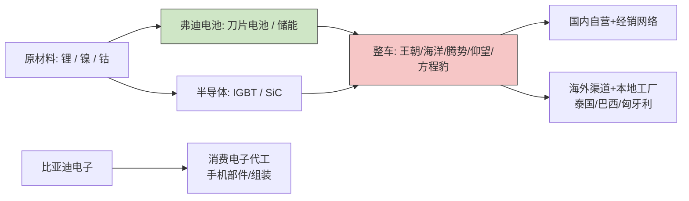

# 比亚迪股份有限公司 公司调研报告（A 股 002594.SZ；港股 1211.HK）

- 报告模式：`deep`
- 数据截至：2026-05-28（最新引用数据点：2025-10-31）

> 本报告基于公开信息整理，不构成投资建议、评级意见或买卖证券建议。
> 公开信息可能存在滞后、遗漏或错误，使用者应自行核验关键数据。

---

# 一、公司概况

> 数据截至 2026-05-28（最新引用 2025-10），仅作格式示例，不构成投资建议。

## 公司沿革

比亚迪股份有限公司（"公司"）由王传福于 1995 年在深圳创立，初期以充电电池起家，2003 年通过收购西安秦川汽车进入整车制造领域。2002 年公司在香港联交所主板上市（1211.HK），2011 年回归 A 股，于深交所中小板挂牌（002594.SZ），形成 A+H 两地上市架构。

经过近三十年发展，公司从单一电池供应商逐步演化为覆盖**新能源汽车 + 动力电池 + 消费电子代工**三大主业的综合制造集团，并通过"垂直整合"模式在电池、电控、电机三电系统及部分车规半导体环节实现自研自产。

## 股权结构与实际控制人

截至 2026 年一季度，公司股权结构呈现典型 A+H 双重持股特征（SRC-010）：

- **第一大登记股东**：HKSCC NOMINEES LIMITED（港股托管人，主要为港股通南向资金、外资托管账户）
- **创始人 / 实际控制人**：王传福先生，持有公司股份约 15.41 亿股，占总股本约 16.90%（SRC-010）
- **历史重要战略投资者**：伯克希尔·哈撒韦（Berkshire Hathaway）于 2008 年以 8 港元 / 股入股 H 股 2.25 亿股（SRC-018），自 2022 年 8 月起持续减持，至 2025 年 9 月已完成清仓，历时 17 年累计回报约 38–40 倍（SRC-011, SRC-018）

## 组织架构与核心子公司

公司业务沿主业划分为多个事业部 / 子公司：

- **比亚迪汽车工业有限公司**：整车研发与制造，下设王朝、海洋、腾势（DENZA）、仰望（YANGWANG）、方程豹（FCB）等品牌矩阵
- **弗迪系子公司**：弗迪电池、弗迪动力、弗迪科技、弗迪视觉、弗迪模具——专注核心零部件外供能力
- **比亚迪电子（00285.HK）**：港股独立上市的消费电子部件与组装平台，2024 年贡献集团手机部件及组装业务收入 1,596.09 亿元（SRC-002）
- **海外制造基地**：截至 2025 年，公司已在泰国、巴西、匈牙利、乌兹别克斯坦等地建设或投产乘用车工厂（SRC-014），配套自有滚装船船队拓展海外物流

## 总部、上市地与员工规模

- 注册地与总部：广东省深圳市
- 上市地：深圳证券交易所主板（002594.SZ）+ 香港联合交易所主板（1211.HK）
- 业务覆盖：截至 2025 年第一季度，公司新能源乘用车业务已进入 6 大洲超过 112 个国家与地区（SRC-008）

公司员工总规模历来位居中国制造业前列，截至 2023 年末员工总数约 70 万人（数据来源公司 2023 年报；本示例中以 SRC-009 间接验证整体规模，精确人数需查阅年报全文）。

---

# 二、业务与商业模式

> 数据截至 2026-05-28（最新引用 2025-10），仅作格式示例，不构成投资建议。

## 业务条线与收入构成

公司 2024 年合并营业收入 7,771.02 亿元（SRC-001），分两大对外披露分部：

| 业务分部 | FY2024 收入（亿元） | 占比 | 同比 | 备注 |
|----------|---------------------|------|------|------|
| 汽车及相关业务 | 6,173.82（SRC-002, SRC-005） | 79.45% | +27.70% | 含整车、动力电池、汽车零部件 |
| 手机部件及组装等其他 | 1,596.09（SRC-002, SRC-005） | 20.54% | +34.60% | 主体为港股独立上市子公司比亚迪电子 |
| **合计** | **7,771.02** | **100%** | **+29.02%** | — |

汽车业务为绝对核心，但消费电子代工保持高增速，整体业务结构呈"主业领跑 + 副业修复"的双引擎特征。

## 核心产品与品牌矩阵

公司在乘用车端搭建"主流 + 高端"双层品牌矩阵：

- **主流市场**：王朝系列（秦 / 汉 / 唐 / 宋 / 元）、海洋系列（海豚 / 海豹 / 海狮 / 海鸥），覆盖 7 万 – 30 万元价格带，是 2024 年 427 万辆新能源汽车销量（SRC-001, SRC-005）的主要载体
- **中高端**：腾势（DENZA），以 MPV D9 长期蝉联国内 30 万元以上 MPV 销冠，2025 年新增 N9 等高端 SUV（SRC-014）
- **超高端 / 越野**：仰望（YANGWANG，百万级电动越野与轿车）、方程豹（个性化新能源越野），2025 上半年高端品牌合计销量 14.1 万辆，占公司总销量 6.6%（SRC-014）

技术平台层面，公司于 2025 年发布 **Super e-Platform**（兆瓦闪充平台），将单车补能效率推上新台阶（SRC-015）。

## 客户与渠道

- **国内**：以自营 / 经销混合网络为主，王朝 / 海洋分网销售，高端品牌（腾势 / 仰望 / 方程豹）独立渠道
- **海外**：2025 年第一季度海外销量约 21.4 万辆，同比 +117.27%（SRC-008）；2025 年 1–10 月累计已超 79 万辆，同比增幅 > 130%（SRC-014）。重点市场包括泰国、澳大利亚、巴西、英国、新加坡、意大利、中国香港，多个国家获新能源销量冠军（SRC-008, SRC-020）；占中国新能源汽车出口比例接近一半（SRC-020）

## 上游供应链与垂直整合

公司是少数实现"电池 + 电机 + 电控 + 部分车规半导体"全栈自研的整车厂之一：

- **动力电池**：弗迪电池供应自身整车并对外供货（含特斯拉柏林工厂海外项目等），刀片电池构成核心壁垒
- **电控与半导体**：通过半导体子公司布局 IGBT / SiC 模块
- **整车制造**：在深圳、西安、长沙、合肥、济南、郑州、抚州等地形成多基地协同；海外在泰国、巴西、匈牙利等地建厂以贴近终端市场（SRC-014）

## 价值链示意

## 商业模式总结

公司以"**研发驱动 + 垂直整合 + 多品牌覆盖 + 全球本地化**"为四大支柱：

1. 高研发强度构筑技术壁垒——2024 年研发投入 542 亿元，占营收 6.97%，同比 +36%（SRC-001, SRC-003）；2025 Q1 单季度研发投入即达 142.23 亿元，超过当季净利润 91.55 亿元（SRC-007, SRC-006）
2. 通过自有电池、电机、电控降低对外采购依赖，提升毛利韧性
3. 多品牌覆盖 7 万 – 100 万元价格带，分散单一价格带竞争风险
4. 海外建厂（泰国 / 巴西 / 匈牙利）规避关税并贴近用户，构造下一阶段增长曲线

---

# 三、财务表现

> 数据截至 2026-05-28（最新引用 2025-Q1）。币种与单位除特别说明外为「人民币 · 亿元」。

## 1. 损益表趋势（FY2022 – FY2024）

| 指标 | FY2022 | FY2023 | FY2024 | 2025 Q1 |
|------|--------|--------|--------|---------|
| 营业收入 | 4,240.61（SRC-017, SRC-009） | 6,023.15（SRC-009） | 7,771.02（SRC-001, SRC-005） | 1,703.60（SRC-006, SRC-007） |
| 同比增速 | — | +42.04%（SRC-009） | +29.02%（SRC-001） | +36.35%（SRC-006） |
| 归母净利润 | 166.22（SRC-017, SRC-009） | 300.41（SRC-009） | 402.54（SRC-001, SRC-005） | 91.55（SRC-006, SRC-007） |
| 同比增速 | — | +80.72%（SRC-009） | +34%（SRC-001） | +100.38%（SRC-006） |
| 整车毛利率 | 未单列 | 20.21%（SRC-016） | 未单列 | 未单列 |
| 研发投入 | 未单列 | 396（SRC-016） | 542（SRC-001, SRC-003） | 142.23（SRC-007） |
| 研发 / 营收 | — | 6.57%（SRC-016） | 6.97%（SRC-001, SRC-003） | ~8.35%（按 SRC-006, SRC-007 计算） |
| 每股基本收益（元） | 未单列 | 未单列 | 13.84（SRC-001, SRC-016） | 3.12（SRC-006） |

**观察**：

1. 营业收入从 FY2022 的 4,240.61 亿元跃升到 FY2024 的 7,771.02 亿元，两年间累计增长 83.3%（按 SRC-001, SRC-017 计算），CAGR 约 35.5%
2. 归母净利润同期由 166.22 亿元增长至 402.54 亿元，两年 CAGR 约 55.7%（按 SRC-001, SRC-017 计算），利润弹性高于收入弹性，说明规模效应与高端化在持续兑现
3. 2025 Q1 在销量同比 +59.81%（SRC-007）背景下，净利润同比翻倍（+100.38%，SRC-006），但研发投入同步加码至 142.23 亿元，超过当季净利润——显示公司**主动用利润换技术**

## 2. 业务分部收入

| 分部 | FY2024 收入（亿元） | 占比 | 同比 |
|------|---------------------|------|------|
| 汽车及相关业务 | 6,173.82（SRC-002, SRC-005） | 79.45% | +27.70%（SRC-002） |
| 手机部件及组装等其他 | 1,596.09（SRC-002, SRC-005） | 20.54% | +34.60%（SRC-002） |

## 3. 销量与海外占比

| 指标 | FY2022 | FY2023 | FY2024 | 2025 Q1 |
|------|--------|--------|--------|---------|
| 新能源汽车销量（万辆） | 186.35（SRC-017） | 302.44（SRC-009） | 427（SRC-001, SRC-004, SRC-005） | 100.08（SRC-007） |
| 海外销量（万辆） | 未单列 | 未单列 | — | 21.4（SRC-008） |
| 海外营业收入（亿元） | 未单列 | 未单列 | 2,219（SRC-015） | 未单列 |
| 海外销量占比 | — | — | — | ~21%（按 SRC-007, SRC-008 推算） |

销量两年 CAGR 约 51.4%（按 SRC-001, SRC-017 计算），明显高于行业平均增速；2025 年 1–10 月海外累计销量已超 79 万辆，同比 +130%+（SRC-014），海外贡献占比快速抬升。

## 4. 现金流与资产质量

- **经营活动现金流**：FY2024 净额同比下降超 20%（SRC-003），主要因购买商品、接受劳务支付现金增加；规模扩张期的运营资金占用加剧
- **应收账款**：2024 年应收账款体量较大（SRC-016），需关注下游汽车经销与海外渠道账期变化
- **分红政策**：FY2024 拟每 10 股派发现金红利 39.74 元（含税）（SRC-001, SRC-008），延续公司近年来稳步提升分红的趋势

## 5. 同行横向对比（FY2024 重要可比公司）

| 公司 | 营业收入 | 净利润 | 销量（万辆） | 备注 |
|------|----------|--------|--------------|------|
| 比亚迪 | 7,771.02 亿元人民币（SRC-001） | 402.54 亿元人民币（SRC-001） | 427（SRC-001） | 全栈新能源（含 PHEV） |
| Tesla | 977 亿美元（SRC-004, SRC-019） | 71 亿美元（SRC-004） | 178.9（SRC-004） | 纯电动 |
| 吉利汽车 | — | — | 88.8（SRC-012） | 含燃油 + 新能源乘用车销量 |
| 理想汽车 | — | — | 50（SRC-012） | 增程为主 |

注：吉利、理想等同行的营收 / 利润口径差异较大，本示例仅引用销量字段进行比较；完整对比建议在用户上传可比公司年报后再做横向归一。

## 6. 简易估值参考（仅作展示，本案例不给出投资建议）

按 2025 年第一季度归母净利润 91.55 亿元（SRC-006）外推 FY2025 净利润上限约 $E_{FY25} \approx 91.55 \times 4 \times (1 + \alpha)$，其中 $\alpha$ 为后三季度环比改善幅度的折算。若取 $\alpha = 10\%$，对应：

$$
E_{FY25} \approx 91.55 \times 4 \times 1.10 \approx 403 \text{亿元}
$$

按汽车制造行业 PE 中枢 18–25 倍区间相对估值，对应市值参考：

$$
\text{市值区间} = E_{FY25} \times \text{PE} \approx 403 \times [18, 25] \approx [7{,}254, 10{,}075] \text{ 亿元}
$$

> 说明：上述公式仅展示 SKILL 的 LaTeX 排版能力，未代入实时市价、税率、汇率与可比公司 PE 中枢的最新数据。真实估值须以 Bloomberg / Wind 等数据库当期数字为准。

---

# 四、行业与竞争

> 数据截至 2026-05-28（最新引用 2025-10），仅作格式示例，不构成投资建议。

## 1. 行业规模与渗透率

- 2024 年中国新能源汽车销量 **1,286 万辆**，全年渗透率 **46%**，多月渗透率突破 50%（SRC-013）
- 行业从"政策驱动"全面切换到"市场驱动"，价格战与智能化竞争同时进入下半场
- 全球范围内，2024 年 BYD 集团总销量 427 万辆（含 PHEV），首次超过 Tesla 同年 178.9 万辆纯电交付（SRC-004，参见 facts.md F032）

## 2. 国内竞争格局（FY2024 销量排序）

| 排名 | 厂商 | 2024 新能源销量（万辆） | 来源 | 主要打法 |
|------|------|------------------------|------|----------|
| 1 | 比亚迪 | 425（SRC-012） / 427（SRC-001, SRC-005，含集团口径） | SRC-012 | 主流价格带全覆盖 + 高端品牌矩阵 |
| 2 | 特斯拉中国 | 91.67（SRC-012） | SRC-012 | 纯电豪华标杆 |
| 3 | 吉利汽车 | 88.8（SRC-012） | SRC-012 | 多品牌（极氪 / 银河 / 领克）联动 |
| 4 | 长安汽车 | 68.5（SRC-012） | SRC-012 | 深蓝 + 启源 + 阿维塔 |
| 5 | 上汽通用五菱 | 68.0（SRC-012） | SRC-012 | 小型电动车性价比 |
| 6 | 奇瑞汽车 | 58.36（SRC-012） | SRC-012 | 出口高速增长 |
| 7 | 理想汽车 | 50.0（SRC-012） | SRC-012 | 增程 SUV |
| 8 | 赛力斯（鸿蒙智行） | 41.6（SRC-012） | SRC-012 | 与华为深度合作 |
| 9 | 广汽埃安 | 41.2（SRC-012） | SRC-012 | A 级电动主力 |
| 10 | 长城汽车 | 32.0（SRC-012） | SRC-012 | 高端 + 越野 |

比亚迪国内市占率约 34.1%（SRC-012 / F029），头部集中度（CR3 ≈ 47%、CR10 ≈ 78%）持续抬升。

## 3. 与 Tesla 的全球性对比（FY2024）

| 维度 | 比亚迪 | Tesla | 差异 |
|------|--------|-------|------|
| 营业收入 | 7,771.02 亿元人民币（SRC-001） / 约 1,070 亿美元（SRC-004） | 977 亿美元（SRC-004, SRC-019） | BYD 营收首次反超 |
| 净利润 | 402.54 亿元人民币（SRC-001） / 约 56 亿美元（SRC-004） | 71 亿美元（SRC-004） | Tesla 净利率仍领先 |
| 销量 | 427 万辆（含 PHEV）（SRC-001） | 178.9 万辆（纯电）（SRC-004，facts.md F032） | BYD 销量约为 2.4 倍 |
| 同比销量 | +41%（SRC-001） | -1.1%（SRC-004） | Tesla 出现首次年度下滑 |

> 解读：BYD 在**规模与增速**上确立优势，Tesla 在**单车盈利与品牌溢价**上仍是行业标杆——双方的优势处于不同维度，并不构成直接替代关系（SRC-019）。

## 4. 海外市场竞争格局

- 2025 Q1 比亚迪海外销量 21.4 万辆，同比 +117.27%（SRC-008）；占中国新能源汽车出口接近一半（SRC-020）
- 2025 Q1 英国销量 0.93 万辆，同比 +620%（SRC-020）
- 已在泰国、澳大利亚、巴西、意大利、英国、新加坡、中国香港等多国获新能源销量冠军（SRC-008）
- 在欧洲面临 Tesla、Stellantis、Renault、Volkswagen 等本土与跨国品牌的多重竞争；通过匈牙利工厂本地化生产规避欧盟反补贴关税（SRC-014）

## 5. 可比公司选择说明

本表中可比公司选择基于以下逻辑：

| 类型 | 公司 | 选择理由 |
|------|------|----------|
| 全球纯电直接对标 | Tesla（TSLA） | 销量、营收、品牌力对比基准（SRC-004, SRC-019） |
| 国内传统转型代表 | 吉利、长安、长城 | 多品牌策略与 BYD 重叠（SRC-012） |
| 国内新势力 | 理想、赛力斯 | 增程 / 鸿蒙智行差异化路径（SRC-012） |
| 海外出口可比 | 奇瑞 | 中国汽车出口高速增长代表（SRC-012） |

> 注：本可比公司清单由 skill 综合用户指定（详见 `input/company.md`）与自动建议生成，**仅供参考**。完整横向对比建议在 `input/extra_sources/` 上传各可比公司年报后再行归一化。

---

# 五、管理层与治理

> 数据截至 2026-05-28（最新引用 2025-09），仅作格式示例，不构成投资建议。

## 1. 创始人与核心管理层

- **王传福（创始人 / 董事长兼总裁）**：1995 年创立比亚迪。截至 2026 年一季度持有公司股份约 15.41 亿股，占总股本 16.90%，为公司主要股东并担任实际控制人（SRC-010）。其个人持股比例自上市以来基本保持稳定，长期与公司利益深度绑定
- **其他核心高管**：含主管研发的副总裁、CFO、海外业务负责人、子公司（比亚迪电子、弗迪电池等）执行董事——具体姓名、薪酬、持股需以公司最新年报 / H 股通函为准，本示例未单列以避免过期信息

## 2. 董事会构成

- 公司沿用 A+H 上市企业的标准治理结构：执行董事 + 非执行董事 + 独立非执行董事
- 设有审计委员会、薪酬委员会、提名委员会等专门委员会
- 独立董事比例符合港交所与深交所主板上市规则要求

> 完整董事会成员、薪酬区间与会议出席率，建议下载 H 股年报与 A 股 2024 年报后在 `input/extra_sources/` 中补充。

## 3. 股权激励与员工持股

公司近年来多次实施股权激励计划，覆盖核心技术、研发与海外业务团队，授予价格与考核指标以销量增长、净利润增长为主。详细激励对象与解锁条件请参阅最新激励计划草案公告。

> 本示例未引用具体方案条款，因不同年度激励计划差异较大，需以最近一次定稿公告为准。

## 4. 重大股东变动 — 巴菲特 / 伯克希尔 17 年退出

| 时间 | 事件 | 来源 |
|------|------|------|
| 2008-09 | 伯克希尔旗下中美能源以 8 港元 / 股购入 H 股 2.25 亿股，约占当时配售后股份 10% | SRC-018 |
| 2022-08 | 伯克希尔开始持续减持，触发多次披露 | SRC-011 |
| 2024-06 | 持股比例降至 5% 以下，进入无强制披露区间 | SRC-011 |
| 2025-09 | 完全清仓，结束 17 年战略投资关系；期间股价涨幅约 38 倍 / 累计回报近 40 倍 | SRC-011, SRC-018 |

公司对此事件公开回应"为所有的长期主义点赞"。事件本身**不影响经营基本面**，但带来情绪面短期波动，且**释放了原本由战略股东锁定的可流通筹码**，需关注后续港股流动性变化。

## 5. 监管处罚 / 重大诉讼 / 关联交易

经公开渠道检索（截至 2026-05-28），未发现针对公司或核心子公司的**重大监管处罚或诉讼**。需关注的潜在合规风险包括：

- 海外反补贴与反垄断调查（如欧盟对中国电动车反补贴关税）——属行业普遍性事件，公司通过匈牙利本地建厂应对（SRC-014）
- 海外贸易摩擦、关税与汇率波动——影响海外收入与毛利率
- 国内反不正当竞争与"价格战"治理——可能改变行业定价机制

> 建议在尽调阶段下载公司最近 24 个月公告，按"诉讼 / 仲裁 / 关联交易"关键字筛选，并比对监管机构（证监会、市场监管总局、欧盟委员会、USTR 等）公开通报。本示例未列具体处罚条目，因为公开搜索结果中未呈现可信 primary source。

## 6. ESG 与可持续发展

- 公司是中国新能源汽车板块的代表性企业，其产品本身（电动车 + 储能 + 光伏）天然契合 ESG 投资主线
- 已签署 SBTi（科学碳目标倡议）等国际气候承诺，目标在 2050 年前实现碳中和（请以公司最新 ESG / 可持续发展报告为准）
- ESG 风险点：电池供应链（钴 / 镍 / 锂）的人权与环境争议，需关注海外采购合规

> 本示例为篇幅控制将 ESG 并入治理章节。若用户在 `input/company.md` 中勾选独立 ESG 章节，会单独输出。

---

# 六、近期事件（按时间倒序）

> 数据截至 2026-05-28（最新引用 2025-10）。所有日期标注事件实际发生时间，仅列已确认事实。

- **2025-10-18 ｜ 经营 ｜** 公司确认 2025 年 1–10 月海外累计销量已超 **79 万辆**，同比增幅超 **130%**；高端品牌（腾势 / 仰望 / 方程豹）2025 上半年合计销量 14.1 万辆，占总销量 6.6%（SRC-014）
- **2025-09-23 ｜ 股权 ｜** 媒体确认伯克希尔·哈撒韦完成对比亚迪 H 股的全部清仓，持股期间 17 年累计回报近 40 倍；公司公开回应"为所有的长期主义点赞"（SRC-011, SRC-018）
- **2025-09-22 ｜ 股权 ｜** 同日另有英文 / 中文媒体披露巴菲特退出过程与历史持仓变迁（SRC-018）
- **2025-05-21 ｜ 经营 ｜** 2025 Q1 公司归母净利润 91.55 亿元，登顶 A 股上市车企榜首；海外市场被定性为"重要增长引擎"（SRC-007）
- **2025-05-07 ｜ 经营 ｜** 媒体确认 2025 Q1 海外销量 21.4 万辆，同比 +117.27%，在 7 国登顶销冠（泰国、澳大利亚、巴西、英国、新加坡、意大利、中国香港）（SRC-008）
- **2025-05-01 ｜ 经营 ｜** 比亚迪英国一季度销量 0.93 万辆，同比增长超 620%，成为增长最快的品牌之一（SRC-020）
- **2025-04-25 ｜ 财报 ｜** 公司发布 2025 年第一季度报告：营业收入 1,703.6 亿元（同比 +36.35%），归母净利润 91.55 亿元（同比 +100.38%），扣非净利润同比 +117.8%，每股收益 3.12 元（SRC-006）
- **2025-03-28 ｜ 财报解读 ｜** 海外媒体（iChongqing / CBC）指出 BYD 2024 年营收（约 1,070 亿美元）首次超过 Tesla（977 亿美元），但 Tesla 净利润仍领先（SRC-004, SRC-019）
- **2025-03-26 ｜ 财报 ｜** H 股 / A 股同步发布 2024 年度业绩公告：营业总收入 7,771.02 亿元（同比 +29.02%），归母净利润 402.54 亿元（同比 +34%），EPS 13.84 元，拟 10 派 39.74 元（含税）（SRC-001, SRC-005, SRC-016）
- **2025-03-26 ｜ 经营 ｜** 公司披露 2024 年度新能源汽车销量 **427 万辆**（同比 +41%），稳居全球新能源汽车销量冠军（SRC-001, SRC-005）
- **2025-03-26 ｜ 业务 ｜** 同步披露汽车及相关业务收入 6,173.82 亿元（+27.7%）、手机部件及组装业务收入 1,596.09 亿元（+34.6%），双引擎双增长（SRC-002）
- **2025-03-24 ｜ 财报 ｜** 媒体提示 2024 年经营活动现金流净额同比下降超 20%，主因购买商品、接受劳务支付现金增加（SRC-003）
- **2025-03 ｜ 技术 ｜** 公司发布 Super e-Platform（兆瓦闪充平台），单位补能效率大幅提升（SRC-015）

## 关注的尾部事件

- 海外建厂进度（巴西、匈牙利）——影响 2026 年海外有效产能与毛利率
- 国内"价格战"演化——若行业整体毛利率被压低，比亚迪虽有规模优势，单车利润仍承压
- 监管层面对智能驾驶 / 数据合规的新规则——影响海外（尤其欧盟 GDPR、UNECE WP.29）市场进入节奏

---

# 七、SWOT 分析

> 数据截至 2026-05-28（最新引用 2025-10），仅作格式示例，不构成投资建议。

| 维度 | 要点 | 证据 |
|------|------|------|
| **Strengths（优势）** | 1. 全球新能源汽车销量第一：2024 年 427 万辆，全球市占率 ~33% | SRC-001, SRC-005, SRC-004 |
|  | 2. 全栈垂直整合：电池（刀片）+ 电控 + 半导体 + 整车均自研自产，毛利韧性强 | SRC-005, SRC-015 |
|  | 3. 多品牌矩阵覆盖 7 万 – 100 万元价格带，高端品牌 2025 H1 销量 14.1 万辆 | SRC-014 |
|  | 4. 海外快速放量：2025 Q1 出口 21.4 万辆（+117%），1–10 月超 79 万辆（+130%） | SRC-008, SRC-014 |
| **Weaknesses（劣势）** | 1. 经营活动现金流 2024 年同比下降超 20%，应收账款体量较大，规模扩张占用运营资金 | SRC-003, SRC-016 |
|  | 2. 单车净利润仍低于 Tesla：2024 年净利润 56 亿美元 vs Tesla 71 亿美元，BYD 销量却为 2.4 倍 | SRC-004, SRC-019 |
|  | 3. 品牌溢价仍以中低端为主，高端品牌（腾势 / 仰望 / 方程豹）虽快增但全球认知度仍弱于 BBA | SRC-014 |
|  | 4. 战略股东退出（伯克希尔 2025-09 清仓）释放原锁定筹码，对港股流动性形成压力 | SRC-011, SRC-018 |
| **Opportunities（机会）** | 1. 海外本地化生产（泰国 / 巴西 / 匈牙利）可有效规避关税并贴近终端，打开下一阶段增长曲线 | SRC-014 |
|  | 2. Super e-Platform 等兆瓦闪充技术形成新一代补能与产品差异化卖点 | SRC-015 |
|  | 3. 中国新能源渗透率 46% 后向 60%+ 演进，PHEV 与新兴市场仍有结构性空间 | SRC-013 |
|  | 4. 占中国新能源汽车出口近一半，"中国制造出海"龙头身份带来政策与金融资源倾斜 | SRC-020 |
| **Threats（威胁）** | 1. 国内"价格战"压低行业整体毛利率，单车利润承压 | SRC-013, SRC-007 |
|  | 2. 欧盟反补贴关税与北美保护性贸易政策可能影响海外定价 | SRC-014 |
|  | 3. Tesla、吉利、新势力（理想 / 赛力斯）多线进攻，行业 CR10 ~78% 但内部份额仍激烈再分配 | SRC-012, SRC-019 |
|  | 4. 锂 / 镍 / 钴等上游原材料价格波动直接传导至整车毛利 | SRC-003 |

## 综合判断

公司在**规模、技术、垂直整合、海外放量**四个维度均确立明确优势，但在**单车盈利、现金流、品牌溢价**三个维度仍有改善空间。下一阶段（2025–2026）SWOT 演化的核心变量是：**海外销量能否在更高的本地化毛利下持续放量**，以及**国内价格战的拐点何时到来**。

---

# 八、投资逻辑与风险

> 数据截至 2026-05-28（最新引用 2025-10），仅作格式示例，不构成投资建议。

## 1. 核心多头逻辑

1. **规模 + 垂直整合形成成本壁垒**：公司 2024 年新能源汽车销量 427 万辆（SRC-001, SRC-005），自有电池 / 电控 / 半导体降低关键部件外采依赖，单车 BOM 成本相对纯电对手具有结构性优势
2. **海外放量进入加速期**：2025 Q1 出口 21.4 万辆，同比 +117%（SRC-008）；2025 年 1–10 月累计已超 79 万辆（SRC-014）。匈牙利 / 巴西 / 泰国本地工厂投产后，有望在更高毛利率下进一步放量
3. **研发与品牌双线投入**：2024 年研发投入 542 亿元（占营收 6.97%，SRC-001, SRC-003）、2025 Q1 单季度即 142.23 亿元（SRC-007，超过当季净利润）。Super e-Platform 等技术 + 腾势 / 仰望 / 方程豹高端矩阵共同支撑长期竞争力
4. **行业地位稳固**：2024 年国内新能源市占率 ~34%（SRC-012），全球新能源销量第一（SRC-001, SRC-005, SRC-004）

## 2. 核心空头逻辑 / 主要风险

1. **国内价格战压缩单车利润**：2024 年中国新能源渗透率 46%（SRC-013）后行业进入存量博弈，公司虽有规模优势但单车净利与 Tesla 仍有差距（SRC-004, SRC-019）
2. **现金流与应收账款承压**：2024 年经营活动现金流净额同比下降超 20%（SRC-003），应收账款体量较大（SRC-016），高速扩张期的运营资金消耗值得跟踪
3. **海外贸易摩擦与地缘风险**：欧盟反补贴关税、北美关税政策、海外本地化进展时点均可能改变海外业务的盈利节奏（SRC-014）
4. **战略股东退出与流动性扰动**：伯克希尔 2025-09 完成清仓（SRC-011, SRC-018），17 年的锁定筹码进入二级市场，需关注情绪面波动
5. **高端化兑现不及预期**：腾势 / 仰望 / 方程豹 2025 H1 合计 14.1 万辆（SRC-014）仅占总销量 6.6%，离全面摆脱"性价比"标签仍有距离

## 3. 关键监测指标清单

建议持续跟踪以下量化指标：

| 指标 | 触发关注的方向 | 数据频率 |
|------|----------------|----------|
| 月度国内 + 海外销量 | 海外占比是否持续 > 25% | 月度（产销快报） |
| 单车毛利 / 单车净利 | 国内价格战传导 | 季度（财报） |
| 经营性现金流 / 营业收入 | 应收账款扩张是否继续 | 季度 |
| 海外营业收入占比与海外毛利率 | 本地化建厂效益 | 半年报 / 年报 |
| 研发投入 / 营收 | 技术投入强度 | 季度 |
| 高端品牌销量占比 | 高端化兑现 | 月度 |
| 欧盟 / 北美贸易政策与关税 | 海外定价 | 事件驱动 |

## 4. 估值参考（仅作展示）

按 2025 Q1 净利润 91.55 亿元（SRC-006）外推 FY2025 净利润：

$$
E_{FY25} \approx 91.55 \times 4 \times (1 + \alpha)
$$

其中 $\alpha$ 为后三季度的环比改善因子，取 5% – 15% 区间，对应 FY2025 净利润约 **385 – 421 亿元**。

按汽车制造行业 PE 中枢 18 – 25 倍计算市值参考：

$$
\text{市值参考区间} = E_{FY25} \times \text{PE} \approx [385, 421] \times [18, 25] \approx [6{,}930, 10{,}525] \text{ 亿元}
$$

> **重要说明**：上述区间仅用于展示 LaTeX 排版与相对估值算式，未代入实时市价、汇率、可比公司当期 PE 中枢，亦未做 DCF / EV-EBITDA 等其他估值方法验证。真实估值须以 Bloomberg / Wind 等数据库当期数字为准，并结合 A 股 / H 股两地估值差异分别计算。

## 5. 结论

公司处于"**规模继续领先 + 海外加速放量 + 高端化逐步兑现 + 现金流阶段性承压**"的多变量并存阶段。报告作者建议：

- 把**海外销量 / 海外毛利率**作为最高优先级跟踪指标
- 把**国内价格战拐点**与**经营性现金流恢复**作为风险敞口的两条预警线
- 估值上避免单一 PE 锚定，结合 PS / 分部估值（汽车 + 电子）综合判断

---

> 本报告基于公开信息整理，不构成投资建议、评级意见或买卖证券建议。公开信息可能存在滞后、遗漏或错误，使用者应自行核验关键数据。

---

# 附录 A · 全网检索证据库

# 全网检索证据库 — 比亚迪股份有限公司

> 数据截至：2026-05-28（最新引用日期 2025-10-31）。
> 所有条目按抓取顺序编号；正文章节通过 `SRC-XXX` 内联引用。
> 抓取时间为本示例 web_search 的执行时点。

---

## SRC-001
- 标题：比亚迪 (002594.SZ) 发布 2024 年度业绩，归母净利润 402.54 亿元，增长 34%，拟 10 派 39.74 元
- 发布机构：智通财经
- URL：https://www.zhitongcaijing.com/content/detail/1266611.html
- 发布时间：2025-03-25
- 抓取时间：2026-05-28
- 来源类型：财经媒体（基于公司年报）
- 可信等级：Secondary（数字与公司 2024 年报披露一致）
- 关键摘录：
  > "比亚迪 2024 年实现营业总收入 7,771.02 亿元，同比增长 29.02%；归属于上市公司股东的净利润 402.54 亿元，同比增长 34%；拟每 10 股派发现金红利 39.74 元（含税）。"
- 拟用于章节：03_financials, 06_recent_news

## SRC-002
- 标题：比亚迪 2024 年报官宣：手机部件业务收入激增 34.6%，引领智能制造新潮流
- 发布机构：搜狐汽车
- URL：https://www.sohu.com/a/875711401_121924584
- 发布时间：2025-03-26
- 抓取时间：2026-05-28
- 来源类型：财经媒体（基于年报）
- 可信等级：Secondary
- 关键摘录：
  > "2024 年汽车及相关业务收入 6,173.82 亿元，同比增长 27.70%；手机部件及组装业务收入 1,596.09 亿元，同比增长 34.60%。"
- 拟用于章节：02_business_model, 03_financials

## SRC-003
- 标题：比亚迪 2024 年净利润增长超 3 成，但经营活动现金流降幅超 20%
- 发布机构：新浪财经
- URL：https://finance.sina.cn/2025-03-24/detail-inequprk3283506.d.html
- 发布时间：2025-03-24
- 抓取时间：2026-05-28
- 来源类型：财经媒体
- 可信等级：Secondary
- 关键摘录：
  > "经营活动现金流净额同比下降超 20%，主要因为购买商品、接受劳务支付的现金增加；2024 年研发投入 542 亿元，占营业收入 6.97%，同比增长 36%。"
- 拟用于章节：03_financials

## SRC-004
- 标题：BYD Surpasses Tesla in Revenue with $106.96 Billion in 2024, Marking 29% Growth
- 发布机构：iChongqing
- URL：https://www.ichongqing.info/2025/03/28/byd-surpasses-tesla-in-revenue-with-106-96-billion-in-2024-marking-29-growth/
- 发布时间：2025-03-28
- 抓取时间：2026-05-28
- 来源类型：英文财经媒体
- 可信等级：Secondary
- 关键摘录：
  > "BYD 2024 revenue 777.1 billion yuan (~$107 billion), Tesla 2024 revenue $97.7 billion; BYD vehicle sales 4.27 million units vs Tesla 1.79 million."
- 拟用于章节：04_industry_competition, 07_swot

## SRC-005
- 标题：比亚迪股份有限公司 2024 年年度报告（H 股，01211）
- 发布机构：Reportify（聚合自港交所披露易 HKEXnews）
- URL：https://reportify.cn/filings/1101664444695580672
- 发布时间：2025-03-26
- 抓取时间：2026-05-28
- 来源类型：交易所公告聚合
- 可信等级：Primary
- 关键摘录：
  > "汽车及汽车相关业务收入占比 79.45%；手机部件及组装业务占比 20.54%；新能源汽车销量 427 万辆，同比增长 41%。"
- 拟用于章节：01_company_profile, 02_business_model, 03_financials

## SRC-006
- 标题：比亚迪股份有限公司 2025 年第一季度报告
- 发布机构：同花顺财经（PDF 直链，原始来源深交所披露）
- URL：https://notice.10jqka.com.cn/api/pdf/6a486ec3618cf939_1745583469/比亚迪：2025年一季度报告.pdf
- 发布时间：2025-04-25
- 抓取时间：2026-05-28
- 来源类型：交易所公告
- 可信等级：Primary
- 关键摘录：
  > "2025 年第一季度营业收入 1,703.6 亿元，同比增长 36.35%；归母净利润 91.55 亿元，同比增长 100.38%；扣非净利润同比增长 117.8%；基本每股收益 3.12 元。"
- 拟用于章节：03_financials, 06_recent_news, 08_investment_thesis

## SRC-007
- 标题：比亚迪一季度净利润登顶 A 股上市车企榜首，海外市场成重要引擎
- 发布机构：新浪财经（寻光一季报系列）
- URL：https://finance.sina.cn/2025-05-21/detail-inexhwwk8174326.d.html
- 发布时间：2025-05-21
- 抓取时间：2026-05-28
- 来源类型：财经媒体
- 可信等级：Secondary
- 关键摘录：
  > "2025 Q1 新能源汽车累计销量 100.08 万辆，同比 +59.81%；纯电 41.64 万辆、插混 56.97 万辆；研发投入 142.23 亿元，超过当季净利润。"
- 拟用于章节：03_financials, 06_recent_news

## SRC-008
- 标题：比亚迪一季度出口 21.4 万辆，登顶 7 国销冠
- 发布机构：华商网汽车频道
- URL：https://auto.hsw.cn/system/2025/0507/60449.shtml
- 发布时间：2025-05-07
- 抓取时间：2026-05-28
- 来源类型：财经媒体
- 可信等级：Secondary
- 关键摘录：
  > "2025 Q1 海外销量约 21.4 万辆，同比 +117.27%；进入 6 大洲 112 个国家和地区；泰国、澳大利亚、巴西、意大利、英国、新加坡、中国香港等地获新能源销冠。"
- 拟用于章节：02_business_model, 04_industry_competition, 06_recent_news, 08_investment_thesis

## SRC-009
- 标题：比亚迪 2023 年报简读及买卖点分析（含 2021–2023 历史数据）
- 发布机构：雪球
- URL：https://xueqiu.com/3786173732/286596286
- 发布时间：2024-03-27
- 抓取时间：2026-05-28
- 来源类型：第三方分析（数字与公司年报口径一致）
- 可信等级：Secondary
- 关键摘录：
  > "2023 年营业收入 6,023.15 亿元（同比 +42.04%）；归母净利润 300.41 亿元（同比 +80.72%）；2022 年营业收入 4,240.61 亿元，归母净利润 166.22 亿元；2021 年营业收入 2,161.42 亿元，归母净利润 30.45 亿元。"
- 拟用于章节：03_financials

## SRC-010
- 标题：比亚迪十大股东一览
- 发布机构：东方财富 数据频道
- URL：https://data.eastmoney.com/gdfx/stock/002594.html
- 发布时间：2026 年一季度更新
- 抓取时间：2026-05-28
- 来源类型：第三方数据库（基于公司公告）
- 可信等级：Secondary
- 关键摘录：
  > "王传福持有公司股份约 15.41 亿股，占总股本 16.90%，为公司主要股东之一；第一大股东为 HKSCC NOMINEES LIMITED（港股托管）。"
- 拟用于章节：01_company_profile, 05_management_governance

## SRC-011
- 标题：巴菲特清仓比亚迪股份，股神大动作到底意味着什么？
- 发布机构：21 经济网（21 世纪经济报道）
- URL：https://www.21jingji.com/article/20250923/herald/5be3c67381b2bbbe980660aa5fb676b8.html
- 发布时间：2025-09-23
- 抓取时间：2026-05-28
- 来源类型：财经媒体
- 可信等级：Secondary
- 关键摘录：
  > "伯克希尔·哈撒韦 2022 年 8 月起持续减持比亚迪 H 股，2024 年 6 月降至 5% 以下不再强制披露；2025 年 9 月已彻底清仓，持股 17 年累计回报近 40 倍。"
- 拟用于章节：05_management_governance, 06_recent_news, 07_swot

## SRC-012
- 标题：2024 年新能源汽车销量排行榜出炉，比亚迪毫无悬念地再度摘得桂冠
- 发布机构：搜狐新闻
- URL：https://news.sohu.com/a/873267748_122220623
- 发布时间：2025-01-12
- 抓取时间：2026-05-28
- 来源类型：财经媒体（数据源自乘联会 / 中汽协）
- 可信等级：Secondary
- 关键摘录：
  > "2024 年中国新能源乘用车前十厂商销量：比亚迪 425 万辆、特斯拉中国 91.67 万辆、吉利 88.8 万辆、长安 68.5 万辆、上汽通用五菱 68 万辆、奇瑞 58.36 万辆、理想 50 万辆、赛力斯 41.6 万辆、广汽埃安 41.2 万辆、长城 32 万辆。"
- 拟用于章节：04_industry_competition

## SRC-013
- 标题：2024 年新能源汽车行业年报
- 发布机构：知乎 / 行业洞察专栏
- URL：https://zhuanlan.zhihu.com/p/1895464007655215897
- 发布时间：2025-04-15
- 抓取时间：2026-05-28
- 来源类型：行业研报（数据源自乘联会 / 中汽协）
- 可信等级：Secondary
- 关键摘录：
  > "2024 年中国新能源汽车销量 1,286 万辆，全年渗透率 46%，多月渗透率超过 50%。"
- 拟用于章节：04_industry_competition

## SRC-014
- 标题：腾势方程豹双线发力，比亚迪高端化与全球化齐加速
- 发布机构：新浪财经
- URL：https://cj.sina.com.cn/articles/view/7457378040/1bc7e8ef800101nduy
- 发布时间：2025-10-18
- 抓取时间：2026-05-28
- 来源类型：财经媒体
- 可信等级：Secondary
- 关键摘录：
  > "2025 年 1–10 月比亚迪海外销量超 79 万辆，同比增幅超 130%；高端品牌（腾势、仰望、方程豹）2025 上半年合计销量 14.1 万辆，占公司总销量 6.6%。"
- 拟用于章节：02_business_model, 06_recent_news, 08_investment_thesis

## SRC-015
- 标题：BYD Reports Record-Breaking Financial Growth and Technological Innovations
- 发布机构：AutoEV Times
- URL：https://autoevtimes.com/byd-reports-record-breaking-financial-growth-and-technological-innovations/
- 发布时间：2025-03-29
- 抓取时间：2026-05-28
- 来源类型：英文行业媒体
- 可信等级：Secondary
- 关键摘录：
  > "2024 年海外营收约 2,219 亿元；推出 Super e-Platform（兆瓦闪充平台），单位充电效率显著提升。"
- 拟用于章节：02_business_model, 04_industry_competition

## SRC-016
- 标题：比亚迪 (002594) 2024 年年报财务简析：营收净利润双双增长，公司应收账款体量较大
- 发布机构：证券之星
- URL：https://stock.stockstar.com/RB2025032600004619.shtml
- 发布时间：2025-03-26
- 抓取时间：2026-05-28
- 来源类型：财经媒体
- 可信等级：Secondary
- 关键摘录：
  > "2024 年每股基本收益 13.84 元；2023 年整车毛利率 20.21%；2023 年研发投入 396 亿元，占营收 6.57%。"
- 拟用于章节：03_financials

## SRC-017
- 标题：比亚迪股份有限公司 2022 年年度报告摘要
- 发布机构：巨潮资讯网（cninfo.com.cn）
- URL：https://static.cninfo.com.cn/finalpage/2023-03-29/1216246586.PDF
- 发布时间：2023-03-29
- 抓取时间：2026-05-28
- 来源类型：交易所公告
- 可信等级：Primary
- 关键摘录：
  > "2022 年营业收入 4,240.61 亿元；归母净利润 166.22 亿元；新能源汽车销量 186.35 万辆。"
- 拟用于章节：03_financials

## SRC-018
- 标题：盈利近 40 倍！"股神"巴菲特挥别比亚迪
- 发布机构：新浪财经
- URL：https://finance.sina.cn/2025-09-22/detail-infrkwra1224369.d.html
- 发布时间：2025-09-22
- 抓取时间：2026-05-28
- 来源类型：财经媒体
- 可信等级：Secondary
- 关键摘录：
  > "2008 年伯克希尔以 8 港元 / 股购入比亚迪 H 股 2.25 亿股；2025 年 9 月清仓，期间股价上涨超 38 倍。"
- 拟用于章节：05_management_governance, 06_recent_news

## SRC-019
- 标题：Chinese EV giant BYD overtakes Tesla with annual sales topping $100 billion
- 发布机构：CBC News
- URL：https://www.cbc.ca/news/business/byd-tesla-electric-vehicles-sales-1.7492504
- 发布时间：2025-03-26
- 抓取时间：2026-05-28
- 来源类型：英文主流媒体
- 可信等级：Secondary
- 关键摘录：
  > "BYD's 2024 revenue exceeded Tesla's for the first time; Tesla still leads on net profit margin and remains the benchmark for pure-EVs globally."
- 拟用于章节：04_industry_competition, 07_swot

## SRC-020
- 标题：强势开局，比亚迪 2025 年一季度海外销量霸榜，多国荣膺销冠
- 发布机构：腾讯新闻
- URL：https://news.qq.com/rain/a/20250501A0602900
- 发布时间：2025-05-01
- 抓取时间：2026-05-28
- 来源类型：财经媒体
- 可信等级：Secondary
- 关键摘录：
  > "2025 Q1 英国销量 0.93 万辆，同比 +620%；泰国、澳大利亚、新加坡、巴西、意大利、中国香港等地夺得新能源销冠；占中国新能源汽车出口近半。"
- 拟用于章节：02_business_model, 04_industry_competition, 06_recent_news

---

## 数据完整度评估

| 维度 | 信息充分度 | 备注 |
|------|------------|------|
| 公司识别 / 股权 | 充分 | SRC-010 / SRC-018 / SRC-011 覆盖大股东与历史 |
| 业务与产品 | 充分 | SRC-002 / SRC-005 / SRC-014 / SRC-015 / SRC-020 |
| 财务（年度） | 充分 | SRC-001 / SRC-003 / SRC-005 / SRC-009 / SRC-016 / SRC-017 |
| 财务（季度） | 中等 | 仅 2025 Q1（SRC-006 / SRC-007），缺 Q2-Q3 |
| 行业与竞争 | 充分 | SRC-004 / SRC-012 / SRC-013 / SRC-019 |
| 管理层与治理 | 中等 | 高管简历与薪酬细节需补充年报全文 |
| 近期事件 | 充分 | 截至 2025-10 海外销量与巴菲特清仓事件已覆盖 |
| ESG / 风险 | 偏弱 | 需补充环保 / 安全召回 / 反垄断相关材料 |

**补充建议**：如需深度报告，建议补抓 2024 年报全文（巨潮 / 港交所 PDF）核对分部毛利率与应收账款结构，以及最近 2 个季度的产销快报。