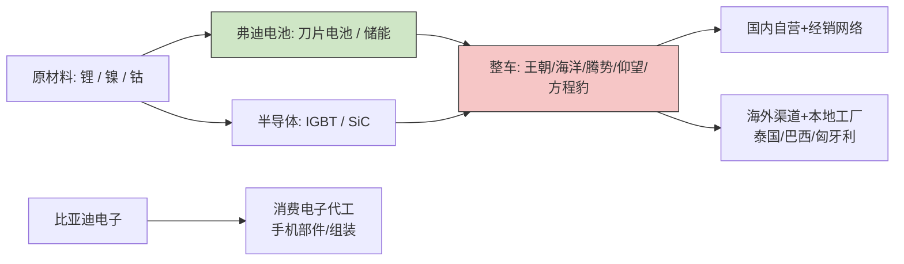

# 二、业务与商业模式

> 数据截至 2026-05-28（最新引用 2025-10），仅作格式示例，不构成投资建议。

## 业务条线与收入构成

公司 2024 年合并营业收入 7,771.02 亿元（SRC-001），分两大对外披露分部：

| 业务分部 | FY2024 收入（亿元） | 占比 | 同比 | 备注 |
|----------|---------------------|------|------|------|
| 汽车及相关业务 | 6,173.82（SRC-002, SRC-005） | 79.45% | +27.70% | 含整车、动力电池、汽车零部件 |
| 手机部件及组装等其他 | 1,596.09（SRC-002, SRC-005） | 20.54% | +34.60% | 主体为港股独立上市子公司比亚迪电子 |
| **合计** | **7,771.02** | **100%** | **+29.02%** | — |

汽车业务为绝对核心，但消费电子代工保持高增速，整体业务结构呈"主业领跑 + 副业修复"的双引擎特征。

## 核心产品与品牌矩阵

公司在乘用车端搭建"主流 + 高端"双层品牌矩阵：

- **主流市场**：王朝系列（秦 / 汉 / 唐 / 宋 / 元）、海洋系列（海豚 / 海豹 / 海狮 / 海鸥），覆盖 7 万 – 30 万元价格带，是 2024 年 427 万辆新能源汽车销量（SRC-001, SRC-005）的主要载体
- **中高端**：腾势（DENZA），以 MPV D9 长期蝉联国内 30 万元以上 MPV 销冠，2025 年新增 N9 等高端 SUV（SRC-014）
- **超高端 / 越野**：仰望（YANGWANG，百万级电动越野与轿车）、方程豹（个性化新能源越野），2025 上半年高端品牌合计销量 14.1 万辆，占公司总销量 6.6%（SRC-014）

技术平台层面，公司于 2025 年发布 **Super e-Platform**（兆瓦闪充平台），将单车补能效率推上新台阶（SRC-015）。

## 客户与渠道

- **国内**：以自营 / 经销混合网络为主，王朝 / 海洋分网销售，高端品牌（腾势 / 仰望 / 方程豹）独立渠道
- **海外**：2025 年第一季度海外销量约 21.4 万辆，同比 +117.27%（SRC-008）；2025 年 1–10 月累计已超 79 万辆，同比增幅 > 130%（SRC-014）。重点市场包括泰国、澳大利亚、巴西、英国、新加坡、意大利、中国香港，多个国家获新能源销量冠军（SRC-008, SRC-020）；占中国新能源汽车出口比例接近一半（SRC-020）

## 上游供应链与垂直整合

公司是少数实现"电池 + 电机 + 电控 + 部分车规半导体"全栈自研的整车厂之一：

- **动力电池**：弗迪电池供应自身整车并对外供货（含特斯拉柏林工厂海外项目等），刀片电池构成核心壁垒
- **电控与半导体**：通过半导体子公司布局 IGBT / SiC 模块
- **整车制造**：在深圳、西安、长沙、合肥、济南、郑州、抚州等地形成多基地协同；海外在泰国、巴西、匈牙利等地建厂以贴近终端市场（SRC-014）

## 价值链示意

## 商业模式总结

公司以"**研发驱动 + 垂直整合 + 多品牌覆盖 + 全球本地化**"为四大支柱：

1. 高研发强度构筑技术壁垒——2024 年研发投入 542 亿元，占营收 6.97%，同比 +36%（SRC-001, SRC-003）；2025 Q1 单季度研发投入即达 142.23 亿元，超过当季净利润 91.55 亿元（SRC-007, SRC-006）
2. 通过自有电池、电机、电控降低对外采购依赖，提升毛利韧性
3. 多品牌覆盖 7 万 – 100 万元价格带，分散单一价格带竞争风险
4. 海外建厂（泰国 / 巴西 / 匈牙利）规避关税并贴近用户，构造下一阶段增长曲线
